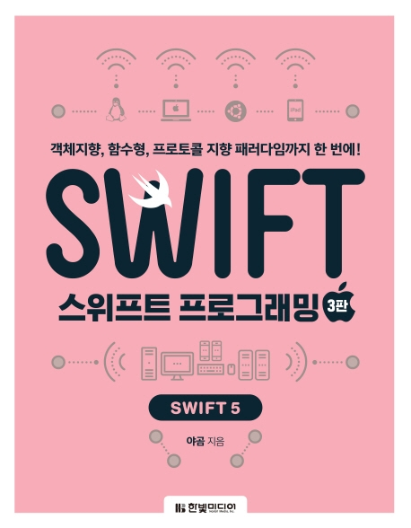

# Books
지금까지 읽어온 책들

## 스위프트 프로그래밍: Swift 5 - 야곰

iOS 개발을 하기로 마음먹고 Swift를 처음 접하면서 산 책입니다. Swift를 공부하기로 마음먹었다면 이 책으로 시작하는 것이 가장 좋은 선택이라고 생각합니다. 다만 프로그래밍을 처음 접하신 분은 중간 이후 직관적으로 이해되지 난해한 않는 문법이 나올 수 있습니다. 그렇지만 반복적으로 읽고 실습하다 보면 어려운 문법도 정복할 수 있다고 생각합니다. 볼 때마다 새로운 개념을 계속 익히게 만들어주는 책입니다.

## 테스트 주도 개발 TDD 실천법과 도구 - 채수원

테스트를 접하고 나서 TDD를 주제로 공부하기 위해서 산 책입니다. 테스트와 TDD에 대한 이론적인 설명을 잘 정리해 둔 책입니다. 테스트를 작성하기 어려운 부분은 어떤 방식으로 해결할 수 있을지에 대한 가이드도 제시해줍니다. Mock을 이용하여 의존성을 제거할 방법을 설명해줍니다. 그리고 각 개발 영역에 대해서 TDD를 어떤 식으로 작성하는지도 설명합니다. 저자분이 직접 몸소 겪고 깨달은 내용을 많이 느낄 수 있었습니다. Java와 JUnit을 가지고 설명하며, Java 환경에 대한 많은 테스트 라이브러리를 소개합니다. Java를 사용하여 설명하지만, Java를 읽을 수 있다면 다른 언어를 사용하는 사람도 충분히 적용해볼 수 있습니다.

## 개발자의 글쓰기 - 김철수

개발자로서 글을 잘 써볼 수 없을까 싶어서 읽어본 책입니다. 책 제목처럼 변수 네이밍부터 글쓰기 기본, 릴리스 노트, 장애 보고서, 제안서, 기술 블로그를 잘 작성할 수 있는 여러 가지 방법과 예시를 들어서 잘 설명해줍니다. 책을 읽기 전에는 의식의 흐름대로 마구잡이로 글이나 문서를 썼다면 책을 읽고 나서는 확실히 유의할 점을 생각하면서 글을 써보게 되는 것 같습니다.

